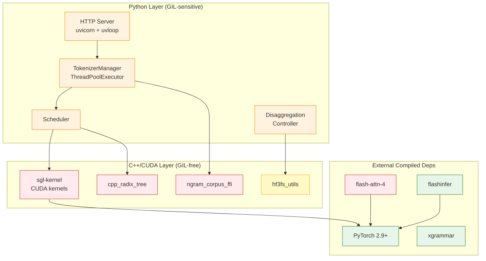

# RFC: Free-Threaded Python (3.14t / nogil) Support for SGLang

## Motivation

CPython 3.13 introduced an experimental free-threaded build (PEP 703) that removes the Global Interpreter Lock (GIL). CPython 3.14t is the first release where this build is stable enough for production use, and the ecosystem of packages with free-threading wheels is growing rapidly.

vLLM has demonstrated ([vllm-project/vllm#18937](https://github.com/vllm-project/vllm/issues/18937)) that a large-scale CUDA-accelerated serving framework can run under a free-threaded interpreter. SGLang shares a similar dependency footprint and architecture. Enabling free-threaded support would unlock true CPU-level parallelism in the Python layer — benefiting the tokenizer manager, scheduler, HTTP server, disaggregation controller, and other asyncio + thread-pool components that today serialize behind the GIL.

This RFC tracks the dependency readiness, identifies the internal code changes needed, and proposes a phased plan to make `uv pip install sglang` work out of the box in a clean Python 3.14t environment on Linux x86-64 (CPU and CUDA).

## Background

| Term | Meaning |
|---|---|
| **3.14t** | The free-threaded (no-GIL) CPython 3.14 build, identified by the `t` suffix in the ABI tag (`cp314t`). |
| **cp314** | The regular (with-GIL) CPython 3.14 build. |
| **Stable ABI** | A subset of the CPython C API that is ABI-compatible across Python versions (PEP 384). Extensions built against the stable ABI only need one wheel per platform, not one per Python minor version. |
| **`Py_GIL_DISABLED`** | The compile-time macro set in free-threaded builds. C extensions must check this to use thread-safe reference counting and data structures. |

### Why 3.14t and not 3.13t?

- CPython 3.14t itself is significantly more stable than 3.13t.
- Key packages (cffi, aiohttp, etc.) support 3.14t but will not back-port to 3.13t.
- PyTorch 2.10.0 (January 2026) will ship full cp314t wheels; PyTorch 2.9.0 already has "preview" wheels.

### Prerequisites

Free-threaded Python support depends on SGLang first supporting regular Python 3.14 (with-GIL). This RFC assumes that prerequisite is met or being tracked separately.

## Dependency Audit

The following tables categorize every SGLang dependency with compiled (C/C++/Rust/CUDA) code by its current free-threading readiness. Pure-Python packages are omitted — they work automatically.

### Core Dependencies (from `pyproject.toml` `dependencies`)

| Package | Current Version | cp314t Wheels on PyPI | Builds from Source | Tracking Issue | Notes |
|---|---|---|---|---|---|
| `torch` | 2.9.1 | Preview (2.9.0); full in 2.10.0 | Yes | — | Core dependency. 2.10.0 (Jan 2026) is the target. |
| `torchaudio` | 2.9.1 | Follows torch | Yes | — | |
| `torchvision` | latest | Follows torch | Yes | — | |
| `torchao` | 0.9.0 | Follows torch | TBD | — | |
| `sglang-kernel` | 0.4.1 | ❌ No | ❌ Needs work | — | **SGLang-owned**. Uses stable ABI (cp310). Needs `Py_GIL_DISABLED` audit. See below. |
| `flash-attn-4` | ≥4.0.0b4 | ❌ No | TBD | — | CUDA extension. |
| `flashinfer_python` | 0.6.7.post2 | ❌ No | Resolved | [flashinfer#1687](https://github.com/flashinfer-ai/flashinfer/issues/1687) | Uses stable ABI; fix was to not use limited API with free-threaded Python. |
| `flashinfer_cubin` | 0.6.7.post2 | ❌ No | TBD | — | Binary CUDA kernels, may need rebuild only. |
| `cuda-python` | 12.9 | TBD | TBD | — | NVIDIA-maintained. |
| `xgrammar` | 0.1.32 | ✅ Yes (≥0.1.31) | ✅ Yes | [xgrammar#500](https://github.com/mlc-ai/xgrammar/issues/500) | Full support. |
| `llguidance` | ≥0.7.11 | ✅ Yes (≥1.6.0) | ✅ Yes | [llguidance#256](https://github.com/guidance-ai/llguidance/issues/256) | Full support. |
| `msgspec` | latest | ✅ Yes (≥0.20.0) | ✅ Yes | — | Full support. |
| `outlines` | 0.1.11 | TBD (outlines-core) | ✅ Yes | [outlines-core#248](https://github.com/dottxt-ai/outlines-core/issues/248) | Depends on outlines-core. |
| `openai-harmony` | 0.0.4 | TBD | ✅ Yes | [harmony#87](https://github.com/openai/openai-harmony/issues/87) | Builds from source. |
| `sentencepiece` | latest | TBD | TBD | — | C++ extension. |
| `tiktoken` | latest | TBD | TBD | — | Rust extension. |
| `orjson` | latest | ✅ Yes | ✅ Yes | — | Rust extension, typically early adopter. |
| `pyzmq` | ≥25.1.2 | ✅ Yes | ✅ Yes | — | |
| `numpy` | latest | ✅ Yes | ✅ Yes | — | |
| `scipy` | latest | ✅ Yes | ✅ Yes | — | |
| `aiohttp` | latest | ✅ Yes | ✅ Yes | — | Supports 3.14t. |
| `pybase64` | latest | TBD | TBD | — | C extension. |
| `setproctitle` | latest | TBD | TBD | — | C extension. |
| `nvidia-ml-py` | latest | Pure Python | N/A | — | |
| `pillow` | latest | ✅ Yes | ✅ Yes | — | |
| `pydantic` | latest | ✅ Yes | ✅ Yes | — | Rust-compiled core. |
| `uvloop` | latest | TBD | TBD | — | C extension (libuv). Critical for asyncio perf. |
| `soundfile` | 0.13.1 | TBD | TBD | — | CFFI-based. |
| `compressed-tensors` | latest | TBD | TBD | — | |
| `quack-kernels` | ≥0.3.0 | ❌ No | TBD | — | CUDA extension. |
| `kernels` | latest | TBD | TBD | — | |
| `smg-grpc-servicer` | ≥0.5.0 | TBD | TBD | — | gRPC bindings. |

### Optional Dependencies (diffusion, ray, tracing)

| Package | cp314t Status | Notes |
|---|---|---|
| `ray` | ❌ No 3.14 support at all | Made optional in vLLM. SGLang already has it as optional (`[ray]`). Not blocking. |
| `opencv-python-headless` | ❌ No | Diffusion extra only. Tracking: [opencv#27933](https://github.com/opencv/opencv-python/issues/27933). |
| `xformers` | ✅ Yes (≥0.0.35) | Resolved by removing CPython C API dependency. |

### SGLang-Owned Compiled Components

| Component | Language | Build System | Free-Threading Status |
|---|---|---|---|
| `sgl-kernel` | C++17 / CUDA | scikit-build-core + CMake | ❌ Uses stable ABI (`cp310`). Needs `Py_GIL_DISABLED` audit and potentially per-version builds. |
| `cpp_radix_tree` (radix cache) | C++ | pybind11 (torch extension) | ❌ Needs thread-safety audit. |
| `ngram_corpus_ffi` | C++ | pybind11 (torch extension) | ❌ Needs thread-safety audit. |
| `hf3fs_utils` | C++ | pybind11 (torch extension) | ⚠️ Uses `py::gil_scoped_release`. Needs `Py_GIL_DISABLED` review. |
| `sgl-model-gateway` (router) | Rust (PyO3) | maturin | ✅ PyO3 has free-threading support. |
| `multimodal_gen` CUDA kernels | C++ / CUDA | setuptools | ❌ Needs audit. |

## Internal Code Audit

### GIL-Dependent Patterns

The following patterns in SGLang's Python code rely on the GIL for correctness and must be reviewed:

1. **Explicit GIL assumptions.** `staging_handler.py` documents: *"CPython GIL guarantees ordering"* for flag visibility between threads. Under free-threading, this needs an explicit memory barrier or `threading.Event`.

2. **`py::gil_scoped_release` in C++ extensions.** `hf3fs_utils.cpp` uses `py::gil_scoped_release` to release the GIL during memcpy. Under free-threading, pybind11's `gil_scoped_release` is a no-op, but the surrounding data structures must be thread-safe without the GIL.

3. **Shared mutable state across threads.** The following areas use thread pools or daemon threads that share mutable Python objects:
   - `TokenizerManager`: `ThreadPoolExecutor` for tokenization with shared request queues
   - `CacheController`: background threads for cache management
   - `KVEvents`: daemon threads for ZMQ event distribution
   - `weight_utils.py`: multi-threaded safetensors loading with shared iterators

4. **Module-level mutable globals.** Several modules use module-level dicts/lists as registries (model registry, format registry, etc.). Under free-threading, concurrent imports or first-access initialization can race.

5. **asyncio + ThreadPoolExecutor interaction.** `run_coroutine_threadsafe` and `call_soon_threadsafe` are used throughout the disaggregation layer. These are asyncio-safe but the callbacks they schedule may access shared state without locks.

### Thread-Safety Classification

| Risk Level | Pattern | Example Locations | Mitigation |
|---|---|---|---|
| **High** | GIL-ordering assumptions | `staging_handler.py:192` | Replace with `threading.Event` or `atomics` |
| **High** | Shared mutable containers across threads | `weight_utils.py` (iterator sharing) | Add `threading.Lock` or use `queue.Queue` |
| **Medium** | Module-level mutable registries | Model/format registries | Use `threading.Lock` for lazy init |
| **Medium** | `concurrent.futures` with shared closures | `async_dynamic_batch_tokenizer.py` | Audit closure captures |
| **Low** | `py::gil_scoped_release` in C++ | `hf3fs_utils.cpp` | Verify data is not shared with Python threads |
| **Low** | Pure asyncio code (single-threaded event loop) | HTTP server, tokenizer manager main loop | Safe by design (single-threaded) |

## Proposed Plan

### Phase 0: Python 3.14 (with-GIL) Support

**Goal:** `pip install sglang` works on regular Python 3.14.

This is a prerequisite and should be tracked separately. Key tasks:
- Update `requires-python` to include 3.14 across all `pyproject.toml` files.
- Pin dependencies to versions that have cp314 wheels.
- Add Python 3.14 to CI matrix.
- Fix any 3.14-specific deprecations or removals in CPython.

### Phase 1: Dependency Readiness Tracking

**Goal:** All dependencies are installable in a 3.14t environment.

- [ ] Create a tracking table (this RFC) and keep it updated.
- [ ] Verify each compiled dependency installs from PyPI or source under 3.14t.
- [ ] File upstream issues for packages without cp314t wheels.
- [ ] For SGLang-owned packages, build and test under 3.14t.

**Immediate blockers (as of writing):**
- `sglang-kernel`: needs rebuild with free-threading support.
- `flash-attn-4`: upstream status unknown.
- `cuda-python`: upstream status unknown.
- `quack-kernels`: upstream status unknown.

### Phase 2: sgl-kernel Free-Threading Support

**Goal:** `sglang-kernel` builds and passes tests under 3.14t.

This is the most critical SGLang-owned component. Current state:
- Uses `scikit-build-core` with stable ABI pinned to `cp310`.
- Contains ~17,650 lines of CUDA/C++ code across 50+ source files.
- Does not directly use CPython C API (uses PyTorch C++ API / pybind11).

Tasks:
- [ ] Audit CMakeLists.txt: the `wheel.py-api = "cp310"` setting pins the stable ABI. Under free-threading, the stable ABI is not available in the same way. Determine whether to build per-Python-version or use the `cp314t` tag.
- [ ] Build sgl-kernel against a 3.14t interpreter and run the test suite.
- [ ] Fix any build or test failures.
- [ ] Add cp314t to the kernel release CI matrix (`release-whl-kernel.yml`).

### Phase 3: Internal C++ Extension Audit

**Goal:** All SGLang-owned C++ extensions are thread-safe without the GIL.

- [ ] `cpp_radix_tree`: audit pybind11 bindings and internal data structures. The radix cache is accessed from the scheduler hot path — any thread-safety issues here are critical.
- [ ] `ngram_corpus_ffi`: audit for shared mutable state.
- [ ] `hf3fs_utils`: replace `py::gil_scoped_release` usage with appropriate pybind11 free-threading annotations (`py::call_guard<py::gil_scoped_release>` is a no-op under 3.14t; verify memcpy targets are not Python-managed memory).
- [ ] `multimodal_gen` CUDA kernels: audit `setup.py` and extension code.

### Phase 4: Python-Level Thread-Safety Fixes

**Goal:** SGLang's Python code does not rely on GIL for correctness.

- [ ] Fix `staging_handler.py` GIL-ordering assumption: replace bare flag check with `threading.Event.wait()`.
- [ ] Audit `weight_utils.py` multi-threaded safetensors loading: ensure the shared iterator and buffer are protected by a lock (they may already be — verify).
- [ ] Audit module-level mutable globals (model registries, format registries): add `threading.Lock` for lazy initialization, or switch to `importlib` patterns that are safe under free-threading.
- [ ] Audit `ThreadPoolExecutor` usage in tokenizer manager: ensure submitted callables do not capture mutable references to shared state without synchronization.
- [ ] Run the full test suite under 3.14t with `PYTHON_GIL=0` and `PYTHONSAFEPATH=1`.

### Phase 5: CI and Release

**Goal:** Free-threaded builds are tested and released.

- [ ] Add Python 3.14t to the CI test matrix (at least lint + unit tests initially).
- [ ] Add cp314t wheel builds to the release workflow for sgl-kernel.
- [ ] Add cp314t to the main SGLang release workflow.
- [ ] Update `requires-python` metadata if needed.
- [ ] Add documentation on running SGLang under free-threaded Python.

### Phase 6: Performance Validation and Optimization

**Goal:** Quantify the benefit of free-threading for SGLang workloads.

- [ ] Benchmark tokenizer throughput (ThreadPoolExecutor is the primary beneficiary).
- [ ] Benchmark HTTP server (uvicorn/uvloop) under concurrent load.
- [ ] Benchmark model loading (multi-threaded safetensors + H2D copy overlap).
- [ ] Benchmark disaggregation controller (asyncio + daemon threads).
- [ ] Profile and fix any contention hotspots revealed by free-threading.
- [ ] Compare end-to-end serving throughput: 3.14 vs. 3.14t.

## Quick-Start: Installing SGLang Under 3.14t Today

This is an approximate recipe for adventurous users. It **will not** work out of the box until the phases above are complete, but shows the current state of the art:

```bash
# Create a free-threaded Python 3.14 environment
uv venv --python=3.14t venv-sglang
source venv-sglang/bin/activate

# Install PyTorch (preview wheels)
uv pip install torch torchaudio torchvision --torch-backend cpu

# Install dependencies that have cp314t wheels
uv pip install numpy scipy aiohttp msgspec xgrammar llguidance orjson pyzmq pillow pydantic

# Install dependencies from source (needs GCC + Rust)
uv pip install --no-binary :all: sentencepiece tiktoken outlines openai-harmony

# sgl-kernel: does not build yet under 3.14t
# flash-attn-4: does not build yet under 3.14t
# cuda-python: TBD

# SGLang itself (CPU-only, after above are resolved):
# uv pip install -e python/
```

## Architecture Diagram



**Legend:** 🟢 Green = ready for 3.14t. 🟡 Yellow = partially ready / needs minor fixes. 🔴 Red = not ready / needs significant work. 🟠 Orange = Python code needing thread-safety audit.

## Open Questions

**Must be resolved before Phase 2:**

- **Stable ABI under free-threading.** sgl-kernel currently uses `wheel.py-api = "cp310"` (stable ABI). Under free-threading, the stable ABI is disabled by default ([CPython docs](https://docs.python.org/3.14/c-api/stable.html)). Should sgl-kernel switch to per-version builds for 3.14t, or can it use the limited API with free-threading-specific adjustments?

- **PyTorch C++ API compatibility.** sgl-kernel and all JIT extensions use `libtorch`. Is PyTorch's C++ API safe to call from multiple threads without the GIL? PyTorch itself has thread-safe operators, but the extension build system (`torch.utils.cpp_extension`) may need changes.

**Must be resolved before Phase 4:**

- **`uvloop` under free-threading.** uvloop is SGLang's default event loop. If uvloop does not support 3.14t, SGLang would fall back to the standard `asyncio` event loop, which may have performance implications. What is uvloop's free-threading status?

- **ZMQ thread safety.** pyzmq is used extensively for inter-process communication. While ZMQ sockets are not thread-safe by design (each socket should be used from one thread), SGLang uses `zmq.asyncio` contexts. Verify that the asyncio integration is safe under free-threading.

**Can be resolved later:**

- **Performance regression threshold.** Free-threaded CPython has a ~5-10% single-threaded overhead due to biased reference counting and per-object locking. What is the acceptable regression for SGLang serving throughput before free-threading benefits outweigh costs?

- **Minimum PyTorch version.** Should SGLang's 3.14t support require PyTorch 2.10.0 (full support) or also work with 2.9.0 (preview)?

- **Scope of platform support.** This RFC targets Linux x86-64. When should aarch64, ROCm, and other platforms be added?

## Validation

- **Unit tests:** Run the full SGLang test suite under `python3.14t` with `PYTHON_GIL=0`.
- **Thread-safety tests:** Use `py-spy` or `threading.settrace` to detect data races under free-threading.
- **Build tests:** Verify sgl-kernel and all C++ extensions build cleanly under 3.14t.
- **Integration tests:** Run end-to-end serving benchmarks (TTFT, throughput, latency) under 3.14t and compare with 3.14.
- **Stress tests:** Run concurrent request load tests to surface race conditions that only manifest under true parallelism.

## Out of Scope

- Windows or macOS support for free-threading.
- Performance optimization of the free-threaded interpreter itself (that's CPython's job).
- Rewriting SGLang's architecture to maximize free-threading benefits (e.g., replacing multiprocessing with multithreading for the scheduler).
- Supporting Python 3.13t.

## References

- [vLLM free-threaded Python tracking issue (vllm-project/vllm#18937)](https://github.com/vllm-project/vllm/issues/18937)
- [PEP 703 – Making the Global Interpreter Lock Optional in CPython](https://peps.python.org/pep-0703/)
- [py-free-threading.github.io – Package tracking](https://py-free-threading.github.io/tracking/)
- [CPython 3.14 free-threaded howto](https://docs.python.org/3.14/howto/free-threading-python.html)
- [PyTorch free-threading support](https://github.com/pytorch/pytorch/issues/130249)
- [scikit-build-core free-threading guide](https://scikit-build-core.readthedocs.io/en/latest/configuration.html#free-threaded)
